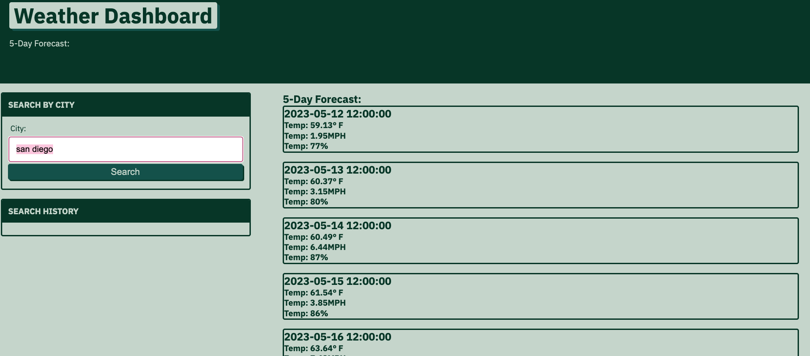

# Weather-Dashboard

## Description

This webpage will display the current weather and five day forecast based on the city you submit.  It will also save your past city searches.  It uses local storage to save the past searches.  The site also makes two API calls to Open Weather API.  One call uses the city name, the second uses the longitude and latitude of that city to then gather the weather information.  

https://openweathermap.org/

## Installation

Here is the URL to access the page: https://pinto006.github.io/Weather-Dashboard/

## Usage

The user should open the webpage and type in the city name they would like weather information for and click the Search buttom.  Once the button is clicked the current weather and the 5 day forecast will display. 

## License

No License
